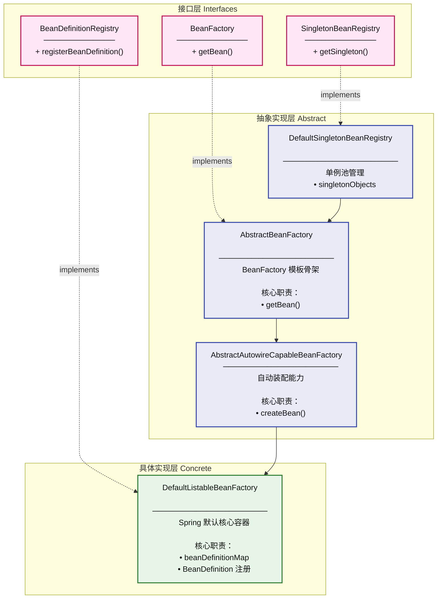

# spring 

## [实现一个简单的Bean容器](https://mp.weixin.qq.com/s?__biz=MzIxMDAwMDAxMw==&mid=2650730551&idx=1&sn=47cfff26ce11cc40c7cdc6495e409c91&chksm=8f6111d5b81698c36470c3413a8343c9e28b04941156317778e06bcae19cf23019a317dc12ad&cur_album_id=1871634116341743621&scene=189&poc_token=HHaa_GmjRrl_7ATmQ19FTa5l5UKDcCxsJNEzMqKG)

核心类说明

| 文件 | 作用 |
|------|------|
| BeanFactory | Bean容器，负责Bean的注册和获取 |
| BeanDefinition | 存储Bean实例信息 |
| UserService | 测试用示例Bean |
| ApiTest | JUnit测试，演示BeanFactory使用 |

当前实现状态
这是一个最简化的Spring容器实现：

- 使用 ConcurrentHashMap 存储Bean定义
- 实现了基础的 getBean() 和 registerBeanDefinition() 方法
- 支持基本的注册和获取功能

## [实现Bean定义、注册、获取](https://mp.weixin.qq.com/s/CgvQzm8B-CvQvXdxONC-lA)

这是一个手写Spring框架的简易版Bean容器项目。有以下设计模式：

### 📊 项目整体架构图



### 🎯 使用的设计模式详解
#### 1. 模板方法模式 (Template Method) ⭐ 核心模式
位置: AbstractBeanFactory.java

```java
public abstract class AbstractBeanFactory extends DefaultSingletonBeanRegistry implements BeanFactory {

    @Override
    public Object getBean(String name) throws BeansException {
        Object bean = getSingleton(name);          // 第1步：先查单例缓存
        if (bean != null) {
            return bean;                           // 命中直接返回
        }
        BeanDefinition beanDefinition = getBeanDefinition(name);  // 第2步：获取定义(抽象)
        return createBean(name, beanDefinition);    // 第3步：创建Bean(抽象)
    }

    protected abstract BeanDefinition getBeanDefinition(String beanName);
    protected abstract Object createBean(String beanName, BeanDefinition beanDefinition);
}
```

特点:
- getBean() 是模板方法，定义了获取Bean的算法骨架
- getBeanDefinition() 和 createBean() 是钩子方法(抽象)，由子类延迟实现
- 注释也明确写了："抽象类定义模板方法"

#### 2. 工厂模式 (Factory Pattern) ⭐ 核心模式
位置: BeanFactory 接口 + DefaultListableBeanFactory


```java
public interface BeanFactory {
    Object getBean(String name);  // 工厂方法
}
```

```java
public class DefaultListableBeanFactory extends AbstractAutowireCapableBeanFactory
implements BeanDefinitionRegistry {
// 具体工厂：负责Bean的定义、注册、创建全流程
}
```
调用方式 (测试用例):

```java
// 1. 初始化 BeanFactory
DefaultListableBeanFactory beanFactory = new DefaultListableBeanFactory();
// 2. 注册 Bean
beanFactory.registerBeanDefinition("userService", beanDefinition);
// 3. 获取 Bean (工厂方法)
UserService userService = (UserService) beanFactory.getBean("userService");
```

特点:
- 隐藏了对象创建的复杂性（反射实例化、单例缓存等）
- 通过接口解耦，使用者只需关心 getBean(name) 即可

#### 3. 单例模式 (Singleton Pattern)
位置: DefaultSingletonBeanRegistry

```java
public class DefaultSingletonBeanRegistry implements SingletonBeanRegistry {

    private Map<String, Object> singletonObjects = new HashMap<>();

    @Override
    public Object getSingleton(String beanName) {
        return singletonObjects.get(beanName);
    }

    protected void addSingleton(String beanName, Object singletonObject) {
        singletonObjects.put(beanName, singletonObject);  // 保证全局唯一
    }
}
```

结合使用场景:

```java
@Override
protected Object createBean(...) throws BeansException {
    Object bean = null;
    try {
        bean = beanDefinition.getBeanClass().newInstance();  // 反射创建
    } catch (...) { ... }
    addSingleton(beanName, bean);  // ✅ 创建后立即注册为单例
    return bean;
}

```

特点:
- 使用容器型单例（Map），而非传统饿汉/懒汉式单例
- 保证同一个 beanName 在整个容器中只有一个实例
- 第一次 getBean("userService") 创建并缓存，第二次直接返回缓存

#### 4. 注册表模式 (Registry Pattern)
位置: BeanDefinitionRegistry 接口 + DefaultListableBeanFactory

```java
public interface BeanDefinitionRegistry {
    void registerBeanDefinition(String beanName, BeanDefinition beanDefinition);
}
```


```java
public class DefaultListableBeanFactory ... implements BeanDefinitionRegistry {

    private final Map<String, BeanDefinition> beanDefinitionMap = new ConcurrentHashMap<>();

    @Override
    public void registerBeanDefinition(String beanName, BeanDefinition beanDefinition) {
        beanDefinitionMap.put(beanName, beanDefinition);  // 注册到Map
    }

    @Override
    protected BeanDefinition getBeanDefinition(String beanName) throws BeansException {
        BeanDefinition beanDefinition = beanDefinitionMap.get(beanName);  // 从注册表查找
        if (beanDefinition == null) {
            throw new BeansException("No bean named '" + beanName + "' is defined");
        }
        return beanDefinition;
    }
}
```
特点:
- 提供集中式的 Bean 定义注册与查找机制
- 使用 ConcurrentHashMap 保证线程安全
- 将"注册"和"查找"职责封装在一起

#### 5. 继承链分层设计 (Layered Architecture via Inheritance)
这是本项目的核心架构设计，采用多层抽象继承：

| 层次 | 类                            | 职责                       |
| :--- | :---------------------------- | :------------------------- |
| L1   | DefaultSingletonBeanRegistry | 单例缓存管理               |
| L2   | AbstractBeanFactory          | 模板方法定义 getBean 骨架  |
| L3   | AbstractAutowireCapableBeanFactory | 实现 createBean (实例化+单例注册) |
| L4   | DefaultListableBeanFactory   | 实现 getBeanDefinition + BeanDefinition注册 |
```text
L4: DefaultListableBeanFactory
    ↑ implements BeanDefinitionRegistry
L3: AbstractAutowireCapableBeanFactory  [createBean实现]
    ↑   
L2: AbstractBeanFactory                 [模板方法getBean]
    ↑ implements BeanFactory
L1: DefaultSingletonBeanRegistry        [单例缓存]
    ↑ implements SingletonBeanRegistry
```
这种设计遵循了单一职责原则(SRP)，每一层只关注一个变化维度。

### 📋 设计模式汇总表

| 设计模式 | 应用位置 | 关键类/接口 | 作用 |
| :--- | :--- | :--- | :--- |
| 🏭 工厂模式 | Bean创建 | BeanFactory, DefaultListableBeanFactory | 封装对象创建细节 |
| 📋 模板方法 | getBean流程 | AbstractBeanFactory.getBean() | 固定算法骨架，延迟实现步骤 |
| 🔵 单例模式 | Bean实例管理 | DefaultSingletonBeanRegistry | 保证Bean全局唯一 |
| 📝 注册表模式 | Bean定义管理 | BeanDefinitionRegistry, beanDefinitionMap | 集中注册与查找 |
| 🧱 继承分层 | 整体架构 | 4层继承链 | 职责分离、可扩展 |

### 💡 总结
这个项目虽然代码量不大（11个Java文件），但非常精炼地模拟了Spring IoC容器的核心设计思想：

1. 模板方法模式是灵魂 — Spring源码中也大量使用这种方式，将固定流程与可变步骤分离
2.工厂+单例+注册表的组合 — 这正是IoC容器的本质：一个管理对象生命周期的大型工厂
3. 分层继承体系 — 与真实Spring的 DefaultListableBeanFactory → AbstractAutowiredCapableBeanFactory → AbstractBeanFactory → FactoryBeanRegistrySupport → DefaultSingletonBeanRegistry 一脉相承


## [基于Cglib实现含构造函数的类实例化策略](https://mp.weixin.qq.com/s/olrwapkSTQMyIGpR10ZDzA)


